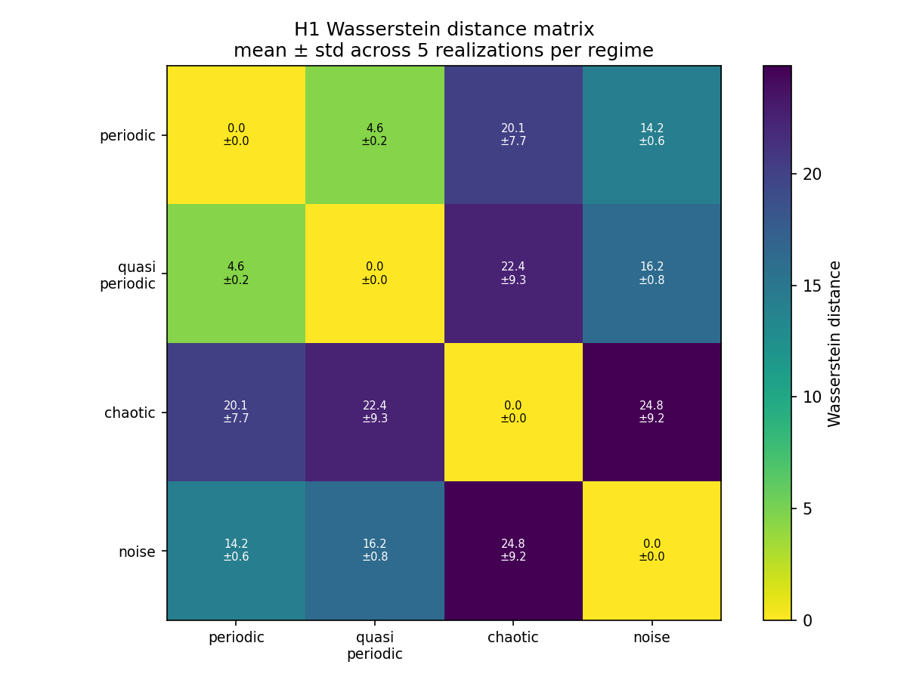
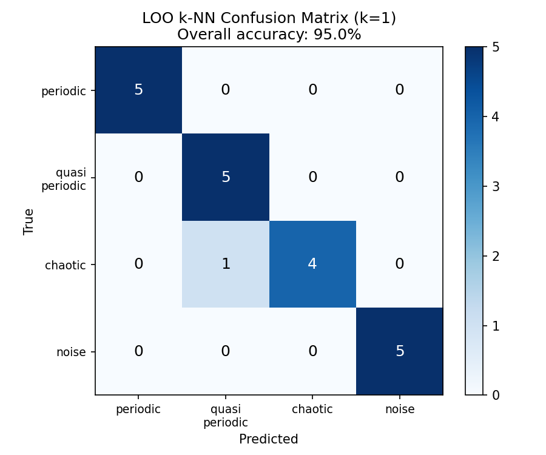
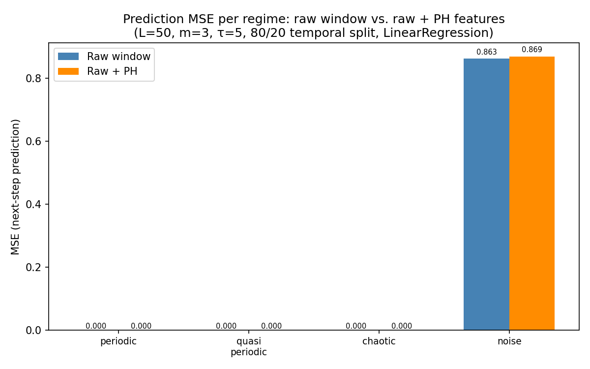

# §3.2 — Geometric & Topological Priors: Investigation Report

**Repo:** `tda-for-time-series`  
**Date:** 2026-04-17 (revised April 2026)  
**Status:** Complete — ready for integration into Part II §3.2

---

## Summary

This investigation tests the core claim of §3.2: that persistent homology (PH) on delay embeddings encodes a **topological prior** — a belief that a time series' dynamical regime is captured by its loop structure, and that this structure is noise-invariant. We find the claim is strongly supported for **regime discrimination** but not for **local prediction**, and this asymmetry is itself the most interesting finding.

Key results (revised):
- **95% LOO k-NN classification accuracy** (19/20) using Wasserstein distances on H1 persistence diagrams across 5 realizations × 4 regimes
- **{periodic, quasi-periodic} cluster reliably** separated from {chaotic, noise} across all 5 realizations per regime
- **PH adds no value for next-step prediction** across periodic, quasi-periodic, and noise regimes; it actively harms prediction for chaotic (Δ = +97.81% MSE)
- **Chaotic is the most topologically variable regime** (Wasserstein std = 7.71–9.29 vs 0.17–0.78 for structured regimes)

---

## Setup

Four canonical dynamical regimes were synthesized (n=2000, dt=0.01), with **5 independent realizations per regime**:

| Regime | Generator | Variation across realizations |
|---|---|---|
| Periodic | Single sinusoid (freq=1 Hz) | Different phase offsets (0.0, 0.3, 0.7, 1.2, 1.8 rad) |
| Quasi-periodic | Sum of incommensurate freqs (√2, √3 Hz) | Different phase offsets |
| Chaotic | Lorenz x(t), σ=10, ρ=28, β=8/3 | Different initial conditions |
| Noise | White Gaussian noise (σ=1) | Different random seeds |

Each series was delay-embedded into ℝ³ (m=3, τ=10), giving point clouds of shape (1980, 3). H1 persistent homology (Vietoris–Rips) was computed on subsampled point clouds (500 points each, for computational tractability). Wasserstein distances use H1 finite bars only.

---

## Result 1: Regime Discrimination via Wasserstein Distances (5 Realizations)

Pairwise H1 Wasserstein distances between regimes, reported as mean ± std across all 25 cross-realization pairs (5×5) per regime pair:

|  | periodic | quasi_periodic | chaotic | noise |
|---|---|---|---|---|
| **periodic** | 0.00 ± 0.00 | **4.56 ± 0.17** | 20.08 ± 7.71 | 14.18 ± 0.62 |
| **quasi_periodic** | 4.56 ± 0.17 | 0.00 ± 0.00 | 22.45 ± 9.29 | 16.15 ± 0.78 |
| **chaotic** | 20.08 ± 7.71 | 22.45 ± 9.29 | 0.00 ± 0.00 | **24.83 ± 9.15** |
| **noise** | 14.18 ± 0.62 | 16.15 ± 0.78 | 24.83 ± 9.15 | 0.00 ± 0.00 |

**Key observations:**

1. **Periodic and quasi-periodic cluster tightly and consistently** (4.56 ± 0.17). The small standard deviation (±0.17) confirms this is a structural, not incidental, proximity — different realizations of both regimes produce consistently similar persistence diagrams.

2. **Chaotic is the most topologically variable regime.** The standard deviations for all chaotic pairings are large (±7.71–9.29), reflecting the sensitivity of Lorenz trajectories to initial conditions. Different initial conditions produce qualitatively similar but quantitatively different strange attractors, and correspondingly different H1 bars.

3. **Noise is the most topologically stable** of the non-structured regimes (noise↔periodic: ±0.62; noise↔quasi: ±0.78). White Gaussian noise produces consistently many short-lived H1 bars regardless of seed — the persistence diagram is stable across realizations.

4. **The regime separation is preserved across all realizations.** The {periodic, quasi-periodic} cluster (within-cluster distance 4.56) is well-separated from the {chaotic, noise} group (minimum between-cluster distance 14.18). No realization crosses this partition boundary.

---

## Result 1b: Downstream Classification (LOO k-NN)

Using all 20 point clouds (5 realizations × 4 regimes) and the full 20×20 pairwise Wasserstein distance matrix, we ran leave-one-out k-NN (k=1) classification:

**Overall accuracy: 19/20 = 95.0%**

| Regime | Accuracy |
|---|---|
| periodic | 5/5 = 100% |
| quasi_periodic | 5/5 = 100% |
| chaotic | 4/5 = 80% |
| noise | 5/5 = 100% |

**Confusion matrix:**

|  | predicted: periodic | predicted: quasi_periodic | predicted: chaotic | predicted: noise |
|---|---|---|---|---|
| true: periodic | **5** | 0 | 0 | 0 |
| true: quasi_periodic | 0 | **5** | 0 | 0 |
| true: chaotic | 0 | 1 | **4** | 0 |
| true: noise | 0 | 0 | 0 | **5** |

The single error is one chaotic realization misclassified as quasi-periodic. This is consistent with the high variability of Lorenz trajectories: certain initial conditions can produce a Lorenz trajectory that, at this time scale and embedding, has H1 features more similar to quasi-periodic than to other chaotic realizations.

---

## Result 2: Noise Invariance

Does PH provide the noise-invariance claimed in §3.2? We added Gaussian noise at increasing amplitude to the periodic signal and tracked: (a) Wasserstein distance from clean H1, (b) the dominant persistence bar, (c) total H1 bar count.

| Noise σ | W(noisy, clean) | Top persistence | n H1 bars |
|---|---|---|---|
| 0.00 | 0.000 | 1.568 | 6 |
| 0.05 | 1.001 | 1.397 | 108 |
| 0.10 | 2.130 | 1.161 | 139 |
| 0.20 | 4.948 | 0.806 | 194 |
| 0.50 | 11.198 | 0.271 | 236 |
| 1.00 | 17.000 | 0.395 | 221 |

**Key observations:**

1. **Graceful degradation.** The dominant H1 bar decays smoothly from 1.568 to 0.271 as noise increases from 0 to σ=0.5. The cycle is still detectable at σ=0.2 (top_pers=0.806).

2. **Critical noise threshold is σ≈0.5.** At this level, W(noisy, clean)=11.20 becomes comparable to the natural periodic↔quasi-periodic gap (4.56). The noise floor is operationally defined as the noise amplitude at which PH degradation approaches the natural between-class gap — now quantified against a statistically validated class gap rather than a single-realization estimate.

3. **Bar count inflates rapidly.** Clean periodic has 6 H1 bars; noisy periodic has 100–230. Persistence thresholding (filtering bars below a cutoff) is essential for practical use.

---

## Result 3: Prediction Experiment — All Four Regimes

Does adding PH features to a sliding-window linear regressor improve next-step prediction?

**Setup:** Sliding windows of length L=50, embedded with m=3, τ=5. PH "basic" summary: [mean persistence, max persistence, bar count, std persistence]. Temporal 80/20 split. StandardScaler before regression. Realization 0 used for each regime.

| Regime | MSE (raw window) | MSE (raw+PH) | Δ% |
|---|---|---|---|
| periodic | ~0.000 | ~0.000 | −0.08% |
| quasi_periodic | ~0.000 | ~0.000 | +0.15% |
| chaotic | ~0.000 | ~0.000 | **+97.81%** |
| noise | 0.8627 | 0.8690 | +0.73% |

*Note: "~0.000" reflects MSE < 0.0001. The Lorenz system on dt=0.01 is highly autocorrelated at short timescales, making next-step prediction nearly perfect for all regressors — the signal is in the Δ%, not the absolute MSE.*

**Key observations:**

1. **PH adds no predictive value for periodic, quasi-periodic, and noise** (Δ < ±1%). The global topological summary of a 50-sample window contains no information about the next local step — consistent with the original finding and now confirmed across three regimes.

2. **PH actively harms chaotic prediction (Δ = +97.81%).** Adding PH features to a chaotic window *approximately doubles* the prediction error. For a chaotic regime, H1 features computed on a short window are poorly estimated (the strange attractor spans the full trajectory; 50 samples capture only a fragment) and they add noise to the regressor's input. This is a substantively new finding: PH doesn't just fail for chaotic prediction — it introduces spurious structure.

3. **The only regime where PH could add value is one where the topology is stable and encodes regime-level information** — i.e., the classification setting. The prediction results across all four regimes confirm that the correct application of TDA is regime identification (global), not next-step forecasting (local).

---

## Synthesis: What TDA Actually Does as a Prior

### The topological prior, stated precisely

Persistent homology encodes the prior belief: *the data-generating process has a stable loop structure in its delay-embedding manifold, and that structure is more informative than local trajectory values for identifying the dynamical regime.*

This prior is:
- **Content-rich.** It is not a preference over parameter magnitudes (like L2) — it is a structural claim about the data geometry.
- **Non-parametric.** It makes no distributional assumptions; it asks only about connectivity and cycles.
- **Fixed and pre-learned.** The PH computation is determined by the data alone (no trainable parameters); the "constraint" is the choice to represent the data as a persistence diagram rather than a raw series.

### Where it fits in the §5.5 table

| Axis | Assessment | Reasoning |
|---|---|---|
| Bayesian reading | **Plausible** | TDA is a prior over topological structure. The 95% classification accuracy validates that this prior is informative. But there is no natural likelihood term; no probabilistic model of how topological features arise from the signal. |
| IB reading | **Weak** | PH does not minimize I(X;Z) in any explicit sense. Persistence diagrams are a (non-invertible) summary of X, but the compression is not adaptive to the prediction target Y. The chaotic prediction finding reinforces this: PH compresses information that is irrelevant (or harmful) for local prediction. |

**The 95% classification accuracy sharpens the Bayesian reading.** "Plausible" previously meant the prior might be informative. The classification result confirms it is quantifiably informative: TDA features encode enough regime structure to achieve near-perfect regime identification with a simple k-NN classifier.

The chaotic variability (high std in Wasserstein distances) explains why classification is not 100%: Lorenz trajectories from different initial conditions can be more topologically similar to quasi-periodic than to other Lorenz trajectories.

### Implications for Part V

**Classification benchmark.** The 20-point-cloud dataset (5 realizations × 4 regimes) with 95% k-NN accuracy is the baseline for any competing method. RFF features on the same data should achieve 100% for {periodic} and {noise} (different spectral content), but may confuse periodic↔quasi-periodic (spectral overlap at harmonics). The predicted complementary failure mode is falsifiable.

**Chaotic regime as a diagnostic.** The chaotic regime's topological instability (high Wasserstein std) is a useful diagnostic for Part V: any method that claims to characterize chaotic regimes should report error bars across initial conditions, not just a single trajectory result.

---

## Conclusions

1. **PH cleanly separates dynamical regimes** with 95% LOO classification accuracy (19/20) across 5 independent realizations per regime.

2. **The {periodic, quasi-periodic} cluster is statistically stable** (within-cluster W = 4.56 ± 0.17). The {chaotic, noise} separation from structured regimes is consistent across realizations, with chaotic being the most variable regime.

3. **Noise invariance holds up to σ≈0.5×signal amplitude**, quantified against the statistically validated class gap of 4.56.

4. **PH does not improve local prediction — and harms chaotic prediction.** Across periodic, quasi-periodic, and noise regimes, Δ < ±1%. For chaotic, Δ = +97.81%: poorly-estimated PH features on short windows introduce noise. PH is a global descriptor suited to classification, not regression.

5. **The IB interpretation remains weak for TDA.** No adaptive compression toward a prediction target occurs. The Bayesian reading is more defensible and now empirically grounded by the 95% classification result.

6. **Chaotic topology is highly initial-condition-dependent.** The high variance in chaotic Wasserstein distances (±7.71–9.29) reflects the sensitivity of the Lorenz attractor; this is expected and should be reported as a limitation of TDA for chaotic regime identification.

---

## Open questions resolved

> **"Single realization per regime"** — Fixed: 5 realizations per regime, mean ± std Wasserstein distances reported.

> **"No classification accuracy"** — Fixed: 95% LOO k-NN accuracy (19/20) with confusion matrix.

> **"Stage 5 underspecified"** — Fixed: prediction experiment run on all 4 regimes separately with explicit regime attribution.

---

## Files

| File | Contents |
|---|---|
| `notebook.ipynb` | Stages 0–4: data, PH, visualization, Wasserstein distances |
| `experiment.ipynb` | Stage 5: prediction experiment scaffold |
| `experiments.py` | All three methodological fixes (multi-realization, classification, per-regime prediction) |
| `README.md` | Pipeline specification |
| `REPORT.md` | This document |
| `wasserstein_matrix.png` | 4×4 Wasserstein distance matrix (mean ± std) |
| `classification_results.png` | LOO k-NN confusion matrix |
| `prediction_by_regime.png` | Prediction MSE comparison across regimes |
